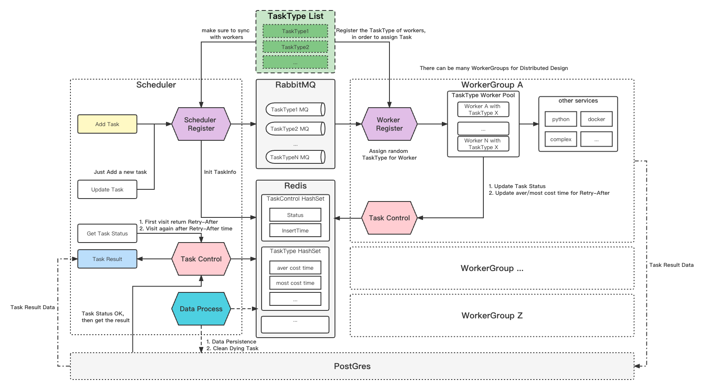

# SuperArchWorker -- Worker

Workers of the Async Rest API

## OverAll



## Run!

Now let me tell you how to run the SuperArchWorker

### Build it

```shell
go mod tidy
cd cmd && go build main.go
```

### Run the bin

```shell
./main
```

SuperArchWorker always do task together with the services:

- https://github.com/ashore2022/Txt2ImageWorker
- https://github.com/ashore2022/Image2txtWorker
- https://github.com/ashore2022/ImagescoreWorker
- ...

## How to Add a new Task Module

1. Write the core code in `core/`
2. Register it in `middleware/register/register.go`
3. If you have some worker's config, please add them in `conf/config.go` 

So easy, too!

## Function

### Register

- Register the task modules
- Recv Task from the Task MQ

### TaskControl

- Update the Task status
- Update the Task type (task cost time, etc.)
- Save result to DB when task finished

## Design Ideas

### SuperArch -- Scheduler

- Use RabbitMQ to make different Module of Tasks different task queues
- Use Reflect method to handle the Modules in single logic
- Task Status Control
- Set the interval time for obtaining task results intelligently and dynamically

### SuperArchWorker -- Worker

- *AllinOne*: A SuperArchWorker contains all the Modules, but only do one module of task which assigned to it
- *High concurrency*: Each SuperArchWorker can do many tasks with n goroutines
- *Flexable*: You can deploy many SuperArchWorkers, even use k8s
- *Compatibility*: A SuperArchWorker can do with all kinds of services, like python,docker or other complex services

## ToDo

- Fix bugs
- Draw the framework of each middleware
